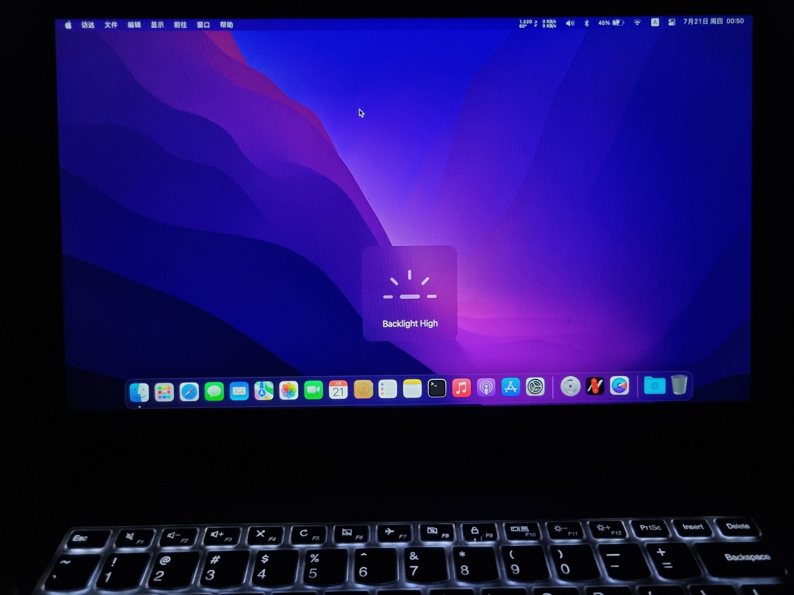

# Lenovo Yoga710 14IKB Hackintosh
## 配置
```
CPU:i707500U
显卡：HD620
内存：三星16G 2133
硬盘：sata 512G 三星 p881
独显：未驱动
网卡：DW1820A
OC版本：0.8.1
系统：12.4
支持联想YogaSMC
```
## 功能完善度
|  功能   | 状态  | 备注 |
|  ----  | ----  | ---- |
| WiFi  | 已驱动 | 需更换网卡
| 蓝牙  | 已驱动 |需更换网卡
| 核显 | 已驱动  |2048mb显存|
| 核显加速 | 已驱动 |
| 核显HDMI | 已驱动  |
| 亮度调节 | 已驱动  |支持快捷键
| 麦克风 | 已驱动  |
| 声卡 | 已驱动  |
| 睡眠 | 已驱动  | s3正常支持usb唤醒
| 摄像头 | 已驱动  |
| 隔空投送 | 已驱动  | 12系统仅支持单向
| HiDpi | 需自行安装 |
| fn功能键控制 | 已驱动  |带图标提示
| 电池护养模式切换 | 已驱动  |
| usb3.0 | 已驱动  |
| 触摸板 | 已驱动  |支持手势
| 触摸屏 | 未驱动 |
| 独显 | 未驱动 |

## 安装
### BIOS设置：
- 关闭安全启动
- 开启intel XGS
### 引导
- 分区必须大于300Mb
- EFI已配置多系统，不会导致win系统主板编号错误
### 硬件
- 网卡需更换dw1820a，并且屏蔽针脚
- 或者更换intel网卡，注意驱动需要更换
## OC主题
- 更多主题请看源文件
## 截图


